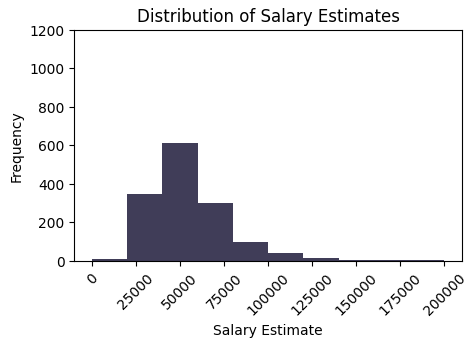

# Data Jobs Analysis Project

This project aims to analyse the UK Data Science Job market using data from Glassdoor and make an ML Model that can predict job salary based on job title, location, sector and other features and deploy this model in a web application.

The data consists of data analyst, data scientist and data engineer roles in the UK from Glassdoor. 

The detailed EDA of this project can be found here.

# Table of Contents

- [Data Cleaning](#data-cleaning)
- [Exploratory Data Analysis](#eda)
- [Modelling](#modelling)

# Data Cleaning
- The Ratings column had ratings in the format '[3.4]'. I cleaned this up and converted the column to float. The column had around 240 null values. I decided to leave them as they were and not impute them. 

- All the values in the salary column were non numeric in the format '£100k'. Some values also had other characters in them. Cleaned them up and replaced k with '000' and converted them to int.

- Created a Region column with just the county names from the location column.

- Removed '--' entries from 'Founded', 'Sector' and 'Industry' and replaced them with NA and created a 'Company Age' column based on 'Founded'. 

- Created a 'Title_Simp' column which had simplified job titles with levels - Data Scientist, Data Engineer, Research, Analyst, MLE, Manager and Director.

- Defined a Seniority column with levels junior and senior based on job title. 

- Defined a size_simp and revenue_simp column based on size and revenue with numbers as different levels. 

- Defined a Remote_yn with binary values based on whether the job is remote or not.

- Defined binary columns for each popular data related skill - python, r, sas, sql, altair, talend, alteryx, pytorch, tensorflow, scikitlearn, spark, mongodb, mysql, deeplearning, tableau, powerbi, excel, aws, azure, googlecloud.  

- Removed duplicate entries.

# EDA

- This section will go through some of the major findings from the EDA. The full report can be found here.

- A histogram of job salaries shows us that most of the salaries were around 50,000 GBP.

# Modelling

I wanted to make a model that could predict the salary of a job listing based on other predictors from the listing. 

- First I decided to remove outliers from the Salary Estimate column. So I defined the lower boundary to be 20000 pounds and the upper boundary to be 1.5 * the third quantile. I then log transformed this column to normalise it so the response variable is now 'log_sal'.

- After looking at multiple models, I decided the best predictors to use were 'Title_Simp', 'Sector', 'Prime_Location', 'revenue_simp' and 'size_simp'.

- I then removed null values from these columns and made dummy variables for the catagorical variables. The modelling was done using the statsmodels package and the model was saved. 

## Metrics

- The model has an R2 value of 43% and an adjusted R2 of 36%. These values are not very high, meaning a lot of the variation in the data is unexplained by this model. The mean absolute error was calculated to be 7701. So the predictions were off by around 7700 GBP. These were the best results I was able achieve given the dataset. More data could yield better results.

Even though the model can't predict accurately, the salary, I decided to go ahead and make the app anyway and also present the salary as a range.

